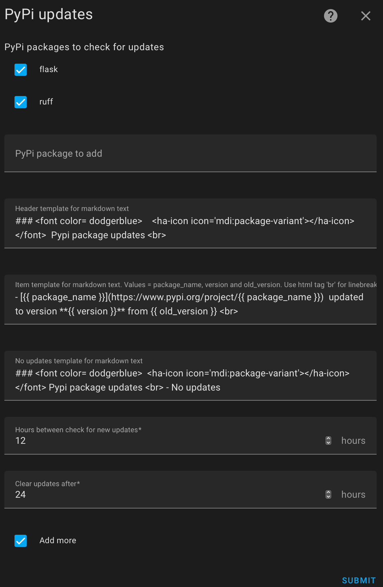
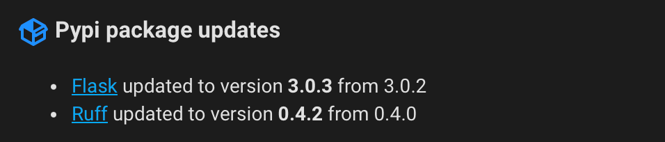

<!-- markdownlint-disable MD041 -->

# PyPi updates

 
The PyPi updates integration allows you to monitor a list of PyPi package and get notified when a updates is available.

## Installation

For installation search for Pypi updates in HACS and download.
Or click
 to add the repository to HACS.

Then click to

## Configuration

Configuration is setup via UI in Home assistant. To add one, go to [Settings > Devices & Services](https://my.home-assistant.io/redirect/integrations) and click the add button. Next choose the [PyPi updates](https://my.home-assistant.io/redirect/config_flow_start?domain=pypi_updates) option.

<!--  -->

 

## Exposed state attributes

The PyPi updates integration provides the following state attributes.

| Attribute     | Description                                                                      |
|---------------|----------------------------------------------------------------------------------|
| pypi_updates  | List of package which have been updated                                          |
| Markdown      | Pre formatted markdown text with updated package information and link to package |

Using the markdown card with the content of the markdown attribute:

<!--  -->

 

## Actions

Available actions: __Reset PyPi updates__ and __Check PyPi__.

### Action pypi_updates.reset_pypi_updates

Reset notification about new updates.

### Action pypi_updates.check_pypi

CHeck for new updates.
